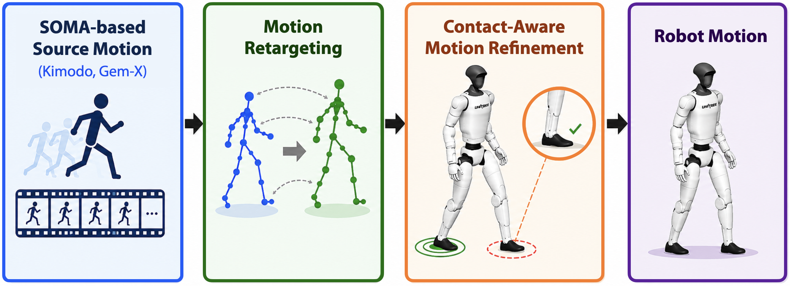

# CoRe: Contact-Aware Motion Retargeting

<p align="center">
  <a href="https://github.com/tmjeong1103/CoRe/actions/workflows/ci.yml"></a>
  <a href="https://huggingface.co/spaces/robotaemoon/CoRe"></a>
  <a href="https://doi.org/10.1109/Humanoids65713.2025.11203055"></a>
  <a href="https://doi.org/10.1109/IROS60139.2025.11246607"></a>
  <a href="LICENSE"></a>
</p>

> [Taemoon Jeong†](https://taemoon.notion.site/taemoon-page)<sup>1</sup>, [Yoonbyung Chai†](https://www.linkedin.com/in/yoonbyung-chai/)<sup>1</sup>, [Sol Choi](https://s-choi-s.github.io/)<sup>2</sup>, [Jaewan Bak](https://jaewan-bak.github.io/)<sup>2</sup>, [Chanwoo Kim](https://chanwookim971024.github.io/)<sup>1</sup>, [Jihwan Yoon](https://www.linkedin.com/in/jihwan-%E2%80%8Dyoon-29182a365/)<sup>1</sup>, [Yisoo Lee](https://sites.google.com/view/kist-arc/home/)<sup>2</sup>, [Jongwon Lee](https://sites.google.com/view/kist-airlab)<sup>2</sup>, [Kyungjae Lee](https://sites.google.com/view/kyungjaelee/)<sup>1</sup>, [Joohyung Kim](https://publish.illinois.edu/kimlab2020/)<sup>3</sup>, and [Sungjoon Choi\*](https://sites.google.com/view/sungjoon-choi/home?authuser=0)<sup>1</sup>
>
> <sup>1</sup>**Korea University** &nbsp; <sup>2</sup>**Korea Institute of Science and Technology (KIST)** &nbsp; <sup>3</sup>**University of Illinois Urbana-Champaign**
>
> † Equal contribution. \* Corresponding author.

<p align="center">
  
</p>

CoRe transforms [SOMA](https://github.com/NVlabs/SOMA-X) human motion into
contact-aware whole-body motion for humanoid robots. It bundles eleven targets
from Unitree Robotics, ROBOTIS, Apptronik, LimX Dynamics, Fourier Intelligence,
PNDbotics, Booster Robotics, and ENGINEAI behind one Python and command-line
interface, with robot-motion `.npz` and video export ready out of the box.

Source motions can be supplied as [Kimodo](https://github.com/nv-tlabs/kimodo)
`.npz` files or [GEM-X](https://github.com/NVlabs/GEM-X) `.pt` files. CoRe
selects the source adapter from the extension and normalizes both formats to the
same SOMA77 stage contract before retargeting.

CoRe uses the [MuJoCo simulator](https://mujoco.org/) to load robot models,
evaluate collision distances, and render motion previews.

The pipeline builds on
[robust robot motion retargeting](https://tmjeong1103.github.io/RMR/)
and
[contact-aware motion refinement](https://tmjeong1103.github.io/CoRe/).

## Highlights

- Contact-aware whole-body retargeting with collision refinement and grounding
- One pipeline for eleven bundled humanoid robot models
- Switch robots with a single `--robot` argument
- Compiled C++ MuJoCo kernels with a portable Python fallback
- Browser, command-line, and Python interfaces
- Kimodo `.npz` and GEM-X `.pt` source-motion adapters
- Sixteen ready-to-run source motions: eight Kimodo `.npz` and eight GEM-X `.pt`
- Reproducible Kimodo and GEM-X batch generation across all eleven robots

## Demo

Try CoRe without installing it. Start with the bundled Kimodo
`foot_walk_stop.npz` or GEM-X `scurry_walk.pt` example in one click, or upload
your own `.npz`/`.pt` SOMA motion. The hosted browser interface retargets it to
any of the eleven bundled humanoid robots, previews the final motion, and
provides the safe robot-motion `.npz` and manifest for download.

[**Launch the live demo on Hugging Face →**](https://huggingface.co/spaces/robotaemoon/CoRe)

<p>
  <a href="https://huggingface.co/spaces/robotaemoon/CoRe">
    
  </a>
</p>

To run the same interface on your own machine, follow the
[local web demo installation](#local-web-demo). It creates an isolated Python
environment before installing the web dependencies and starting the server.

## Result videos

The gallery presents two representative source motions across all eleven
supported humanoid robots. Results follow the public robot order:
**G1, H1, H2, R1, K1, Apollo, Oli, N1, ADAM Lite, T1, PM01**.

Each motion uses one wide player row. Scroll horizontally to compare all
eleven robots.

<details open>
<summary><b>(From Kimodo) Stand, walk, run, stop — all 11 robots</b></summary>

<br>

<div style="width: 100%; overflow-x: auto;">
<table style="display: block; overflow-x: auto; white-space: nowrap;">
  <tr>
    <td align="center"><b>G1</b><br><video src="https://github.com/user-attachments/assets/a79a31e6-ee5e-4a2f-9006-828998e41173" width="240" controls preload="metadata"></video></td>
    <td align="center"><b>H1</b><br><video src="https://github.com/user-attachments/assets/dbb48b8b-3781-480a-8720-c978563aa68d" width="240" controls preload="metadata"></video></td>
    <td align="center"><b>H2</b><br><video src="https://github.com/user-attachments/assets/3ee61c33-175a-4ff8-9646-28e7822b1f78" width="240" controls preload="metadata"></video></td>
    <td align="center"><b>R1</b><br><video src="https://github.com/user-attachments/assets/aede49f5-a434-4ff1-ac83-7260f8cd9e34" width="240" controls preload="metadata"></video></td>
    <td align="center"><b>K1</b><br><video src="https://github.com/user-attachments/assets/81627425-d22d-4b9d-b657-cd0da41c93c0" width="240" controls preload="metadata"></video></td>
    <td align="center"><b>Apollo</b><br><video src="https://github.com/user-attachments/assets/f8c23215-b548-446c-9be1-d24bd135d9f9" width="240" controls preload="metadata"></video></td>
    <td align="center"><b>Oli</b><br><video src="https://github.com/user-attachments/assets/a77a38ec-e49b-409a-9a03-29b349a55c9f" width="240" controls preload="metadata"></video></td>
    <td align="center"><b>N1</b><br><video src="https://github.com/user-attachments/assets/e8c806ff-9ad5-430a-9126-05f245c803a8" width="240" controls preload="metadata"></video></td>
    <td align="center"><b>ADAM Lite</b><br><video src="https://github.com/user-attachments/assets/3e516e1b-16a7-4b03-893d-ba62e1c0f8ed" width="240" controls preload="metadata"></video></td>
    <td align="center"><b>T1</b><br><video src="https://github.com/user-attachments/assets/66ceb0b7-b9a7-4f17-8389-0a268c9a5bd6" width="240" controls preload="metadata"></video></td>
    <td align="center"><b>PM01</b><br><video src="https://github.com/user-attachments/assets/5cc1e092-010f-48f9-8ab1-0d314c0fd0aa" width="240" controls preload="metadata"></video></td>
  </tr>
</table>
</div>
</details>

<details open>
<summary><b>(From GEM-X) Rapid Stepping — all 11 robots</b></summary>

<br>

<div style="width: 100%; overflow-x: auto;">
<table style="display: block; overflow-x: auto; white-space: nowrap;">
  <tr>
    <td align="center"><b>G1</b><br><video src="https://github.com/user-attachments/assets/0a9cc7d7-865d-46ab-94e6-85d5957c4d72" width="240" controls preload="metadata"></video></td>
    <td align="center"><b>H1</b><br><video src="https://github.com/user-attachments/assets/64adda0a-7a19-401d-8f56-595cb4907403" width="240" controls preload="metadata"></video></td>
    <td align="center"><b>H2</b><br><video src="https://github.com/user-attachments/assets/125f5807-ac62-4cd5-bbb5-4256f727596c" width="240" controls preload="metadata"></video></td>
    <td align="center"><b>R1</b><br><video src="https://github.com/user-attachments/assets/340998e5-d47f-4666-99ce-3c9a2b870b02" width="240" controls preload="metadata"></video></td>
    <td align="center"><b>K1</b><br><video src="https://github.com/user-attachments/assets/ff63590b-e914-492e-8613-ce28c842df96" width="240" controls preload="metadata"></video></td>
    <td align="center"><b>Apollo</b><br><video src="https://github.com/user-attachments/assets/fe9dffa8-2e38-4121-8408-903b257b71cb" width="240" controls preload="metadata"></video></td>
    <td align="center"><b>Oli</b><br><video src="https://github.com/user-attachments/assets/a61347cb-4f5b-467c-8dfa-35a1018139fc" width="240" controls preload="metadata"></video></td>
    <td align="center"><b>N1</b><br><video src="https://github.com/user-attachments/assets/9a91a33f-a534-45a8-92a4-17dcf36d6530" width="240" controls preload="metadata"></video></td>
    <td align="center"><b>ADAM Lite</b><br><video src="https://github.com/user-attachments/assets/1306ca93-de06-4646-98fc-c549c03ab11c" width="240" controls preload="metadata"></video></td>
    <td align="center"><b>T1</b><br><video src="https://github.com/user-attachments/assets/4561453a-4773-4f68-bab0-d789ac2ddff1" width="240" controls preload="metadata"></video></td>
    <td align="center"><b>PM01</b><br><video src="https://github.com/user-attachments/assets/01cafa93-272d-4000-bf48-ca155cc1bc83" width="240" controls preload="metadata"></video></td>
  </tr>
</table>
</div>
</details>

Generate results for the other bundled Kimodo and GEM-X motions with
[scripts/generate_example_outputs.py](scripts/generate_example_outputs.py).

## Supported robots

| # | Manufacturer | Robot | Robot ID |
|---:|---|---|---|
| 1 | Unitree Robotics | G1 29-DOF | `g1` |
| 2 | Unitree Robotics | H1 | `h1` |
| 3 | Unitree Robotics | H2 | `h2` |
| 4 | Unitree Robotics | R1 | `r1` |
| 5 | ROBOTIS | K1 | `k1` |
| 6 | Apptronik | Apollo | `apollo` |
| 7 | LimX Dynamics | Oli | `oli` |
| 8 | Fourier Intelligence | N1 | `n1` |
| 9 | PNDbotics | ADAM Lite | `adam` |
| 10 | Booster Robotics | T1 | `t1` |
| 11 | ENGINEAI | PM01 | `pm01` |
| — | More manufacturers | **More humanoid robots coming soon** | — |

Switch the target humanoid by changing a single `--robot` argument.

## Supported platforms

CoRe officially supports macOS and Ubuntu Linux with Python 3.10 through
3.13. The native backend, test suite, and package installation are validated
on macOS; GitHub Actions runs the Python 3.10–3.13 test matrix, native backend,
headless rendering, and Docker deployment checks on Ubuntu.

## Installation

Installing from source requires a C++17 compiler; the package builds the
native MuJoCo kernels during installation.

```bash
git clone https://github.com/tmjeong1103/CoRe.git
cd CoRe

python3.10 -m venv .venv
source .venv/bin/activate
python -m pip install --upgrade pip
```

Choose the installation that matches the interface you want to use.

### Command-line and Python interfaces

```bash
# Install CLI rendering plus both Kimodo .npz and GEM-X .pt input support.
python -m pip install -e ".[gemx,video]"

# Confirm that the compiled backend is available.
core-retarget backend --require-native
```

### Local web demo

The `web` extra includes the GEM-X, video-rendering, and browser-server
dependencies. Install it inside the activated virtual environment and start
the server:

```bash
python -m pip install -e ".[web]"
core-retarget serve
```

The local browser demo listens on
[http://127.0.0.1:8000](http://127.0.0.1:8000) by default. Uploaded motions and
results stay on the local machine under `runs/web`. Open the address after the
server starts. Customize the host, port, upload limit, and storage directory
with:

```bash
core-retarget serve \
  --host 127.0.0.1 \
  --port 8000 \
  --runs-dir runs/web \
  --max-upload-mb 256
```

The local demo executes one retargeting job at a time to keep MuJoCo and CPU
usage predictable. Additional submissions wait in the local queue.

<details>
<summary><b>Deploy as a Hugging Face Space</b></summary>

CoRe includes a production-oriented Docker Space image with the native C++
backend, headless MuJoCo rendering, bounded public queue, and automatic result
expiration. [Open the live CoRe demo](https://huggingface.co/spaces/robotaemoon/CoRe)
or see the [Hugging Face deployment guide](docs/huggingface-space.md).

</details>

## Quick start

CoRe selects the source adapter from the filename extension. Run a bundled
Kimodo motion on Unitree G1 with:

```bash
core-retarget run \
  examples/motions/kimodo/soma_rp_v11/stand_walk_run_stop.npz \
  --robot g1 \
  --output runs/kimodo-g1 \
  --video \
  --thumbnail
```

Run a bundled GEM-X motion with the same command. GEM-X `.pt` does not store its
sampling rate, so pass the rate used to generate the motion; the bundled GEM-X
examples are 30 Hz:

```bash
core-retarget run \
  examples/motions/gem-x/rapid_stepping.pt \
  --robot g1 \
  --fps 30 \
  --output runs/gemx-g1 \
  --video \
  --thumbnail
```

The generated results are written below the selected output root:

```text
runs/kimodo-g1/stand_walk_run_stop/g1/
├── final/robot_motion.npz
├── preview/final.mp4
├── preview/final.png
└── manifest.json

runs/gemx-g1/rapid_stepping/g1/
├── final/robot_motion.npz
├── preview/final.mp4
├── preview/final.png
└── manifest.json
```

To target another robot, change `--robot g1` to any ID in the supported-robots
table above.

<details>
<summary><b>Compute backend selection</b></summary>

CoRe uses the compiled C++ backend automatically when it is available. Every
result manifest records the requested and selected backend. Use
`--backend native` to require C++, or `--backend python` to run the portable
Python backend explicitly:

```bash
core-retarget backend
core-retarget run \
  examples/motions/kimodo/soma_rp_v11/stand_walk_run_stop.npz \
  --robot g1 \
  --output runs/native-g1 \
  --backend native
```

Replace the bundled `.npz` path with the path to your own Kimodo `.npz` or
GEM-X `.pt` source motion when needed.

</details>

<details>
<summary><b>Generate all 16 bundled motions for all 11 robots</b></summary>

Kimodo (`.npz`):

```bash
python scripts/generate_example_outputs.py \
  --source-set kimodo \
  --output runs/example-outputs \
  --gallery-dir docs/media/final
```

GEM-X (`.pt`, 30 Hz):

```bash
python scripts/generate_example_outputs.py \
  --source-set gem-x \
  --output runs/gem-x-example-outputs \
  --gallery-dir docs/media/final
```

Add `--resume` to continue an interrupted batch.

</details>

## Python API

The Python API uses the same extension-based dispatch and output format as the
CLI. Run a Kimodo `.npz` with its embedded or default FPS:

```python
from core_retarget import Retargeter, RunConfig

kimodo_result = Retargeter(
    "g1",
    RunConfig(robot="g1", backend="auto"),
).run(
    "examples/motions/kimodo/soma_rp_v11/stand_walk_run_stop.npz",
    "runs/python-kimodo-demo",
    render_video=True,
    render_thumbnail=True,
)

print(kimodo_result.final_motion_path)
print(kimodo_result.video_path)
```

For GEM-X `.pt`, use the same API and supply the source FPS explicitly:

```python
from core_retarget import Retargeter, RunConfig

gemx_result = Retargeter(
    "g1",
    RunConfig(robot="g1", fps=30.0, backend="auto"),
).run(
    "examples/motions/gem-x/rapid_stepping.pt",
    "runs/python-gemx-demo",
    render_video=True,
    render_thumbnail=True,
)

print(gemx_result.final_motion_path)
print(gemx_result.video_path)
```

## Input and output

SOMA-compatible source motions can be generated with
[Kimodo](https://github.com/nv-tlabs/kimodo) or
[GEM-X](https://github.com/NVlabs/GEM-X). CoRe dispatches by extension:

- `.npz` means a Kimodo SOMA77 motion with global joint positions and rotations.
- `.pt` means a GEM-X SOMA body-parameter result. Install the `gemx` extra for
  command-line or Python `.pt` input: `python -m pip install -e ".[gemx,video]"`.
  The `web` extra already includes this dependency.

See the [source-motion contract](docs/input-format.md) for the required keys,
FPS behavior, and safe-loading rules. The bundled examples contain eight
Kimodo `.npz` motions and eight GEM-X `.pt` motions.

Regardless of source format, the output remains a versioned robot-motion `.npz`
containing timestamps, MuJoCo `qpos`, named root/joint layouts, and contact
information. It has no object arrays or pickle payloads. Load it safely with:

```python
import numpy as np

motion = np.load("robot_motion.npz", allow_pickle=False)
qpos = motion["qpos"]
```

> [!NOTE]
> CoRe is research software. Inspect generated motions in simulation before
> using them on physical hardware.

## Documentation

- [Input motion format](docs/input-format.md)
- [Robot models](docs/robots.md)
- [Pipeline architecture](docs/architecture.md)
- [Licenses and provenance](docs/licenses.md)

## Contact

CoRe is created and maintained by
[Taemoon Jeong](https://taemoon.notion.site/taemoon-page).

- Email: [taemoon-jeong@korea.ac.kr](mailto:taemoon-jeong@korea.ac.kr)
- Profiles: [GitHub](https://github.com/tmjeong1103) · [LinkedIn](https://www.linkedin.com/in/taemoon-jeong-b84502306/) · [Google Scholar](https://scholar.google.co.kr/citations?user=RksrV_QAAAAJ&hl=ko)
- Bug reports and feature requests: [GitHub Issues](https://github.com/tmjeong1103/CoRe/issues)

## Acknowledgments

This project was developed at the
[Robot Intelligence Lab](https://sites.google.com/view/sungjoon-choi/home),
Korea University, under the guidance of
[Professor Sungjoon Choi](https://github.com/sjchoi86).

## Citation

If you use CoRe in your research, please cite both papers:

```bibtex
@inproceedings{jeong2025core,
  author    = {Jeong, Taemoon and Chai, Yoonbyung and Choi, Sol and
               Bak, Jaewan and Kim, Chanwoo and Yoon, Jihwan and
               Lee, Yisoo and Lee, Jongwon and Lee, Kyungjae and
               Kim, Joohyung and Choi, Sungjoon},
  title     = {CoRe: A Hybrid Approach of Contact-Aware Optimization
               and Learning for Humanoid Robot Motions},
  booktitle = {2025 IEEE-RAS 24th International Conference on
               Humanoid Robots (Humanoids)},
  year      = {2025},
  pages     = {293--300},
  doi       = {10.1109/Humanoids65713.2025.11203055}
}

@inproceedings{jeong2025robust,
  author    = {Jeong, Taemoon and Byun, Taehyun and Kim, Jihoon and
               Choi, Keunjun and Oh, Jaesung and Lee, Sungpyo and
               Darwish, Omar and Kim, Joohyung and Choi, Sungjoon},
  title     = {Robust and Expressive Humanoid Motion Retargeting via
               Optimization-Based Rig Unification},
  booktitle = {2025 IEEE/RSJ International Conference on
               Intelligent Robots and Systems (IROS)},
  year      = {2025},
  pages     = {21619--21626},
  doi       = {10.1109/IROS60139.2025.11246607}
}
```

## License

CoRe source code is released under the [Apache License 2.0](LICENSE). The
bundled example motions are licensed under
[CC BY 4.0](examples/LICENSE.md), Copyright 2026 Taemoon Jeong. Bundled robot
descriptions retain their respective licenses and provenance; see
[THIRD_PARTY_NOTICES.md](THIRD_PARTY_NOTICES.md) and
[docs/licenses.md](docs/licenses.md) for details.
